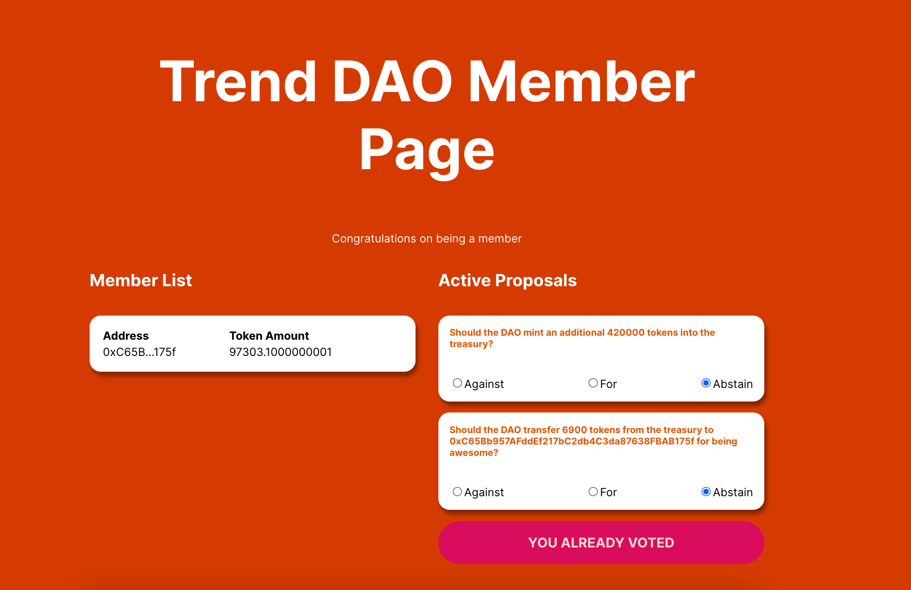

# Build own TrendDAO with ThirdWeb

* ✍️ deploy my own NFT bundle for friends to mint
* 💰 deploy a custom ERC-20 token
* 🚀 airdrop tokens to let users vote on proposals

### **Welcome 👋**
To get started with this project, clone this repo and follow these commands:

1. Run `npm install` at the root of your directory
2. Run `npm start` to start the project
3. Start

### **Scripts**

1. deploy drop
2. config nft
3. set claim condition
4. claim nft
5. deploy token
6. print total supply
7. airdrop token
8. deploy vote
9. setup vote
10. create vote proposals
11. revoke roles

### Project url
```
https://trend-dao.jiashuaichang.repl.co/
```

### Screenshot




